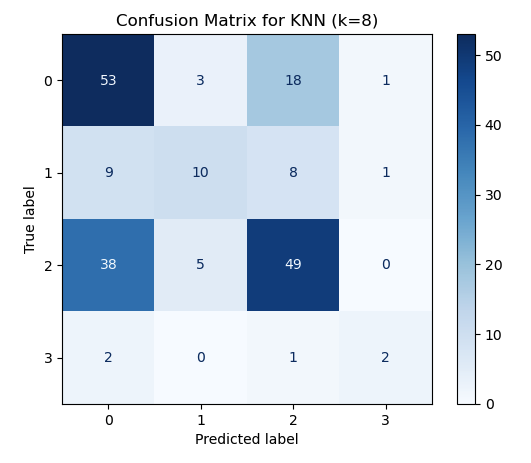

# 📦 Predictive Modeling for Container Logistics – DP World  

## 📌 Project Overview  
This project explores the use of **machine learning techniques** to optimize container logistics operations at DP World. The maritime industry handles massive volumes of containers daily, making **accurate forecasting** and **efficient classification** of container flows critical for resource allocation, cost reduction, and improved customer service.  

We address two major challenges:  
1. **Forecasting Task** – Predicting weekly container counts to anticipate demand and avoid bottlenecks.  
2. **Classification Task** – Categorizing containers based on time-of-arrival windows and demand patterns for operational efficiency.  

---

## 📂 Dataset  
- Source: Container operations data from **DP World (2024)**.  
- Size: ~5,000 instances, each with detailed attributes such as:  
  - Container ID, Line Code, Date & Time of movements  
  - Container Type, ISO Code, Dimensions, Ventilation, Designation (Import, Export, Transshipment)  
- Features were cleaned, encoded, and grouped by **week** for forecasting tasks.  

[Dataset File](https://github.com/abdurrahman-03/Predictive-Modeling-for-Container-Logistics-DP-World-/blob/main/ShippingData1.csv)

---

## ⚙️ Methodology  

### 1. Forecasting Models ([See Code](https://github.com/abdurrahman-03/Predictive-Modeling-for-Container-Logistics-DP-World-/blob/main/Forecasting_Model.ipynb))   
- **Linear Regression** – baseline model, captured linear trends but struggled with complex patterns. 
- **Random Forest Regressor** – tuned with GridSearchCV + 5-fold cross-validation. 
  - Achieved **R² ≈ 0.93** on test folds vs. **0.58** for Linear Regression.  
  - Significantly lower MSE, making it the preferred forecasting model.  

**Visuals:**  
- Random Forest predictions vs. actual container counts  

- Linear Regression predictions vs. actual counts  

- Combined comparison plot (RF vs. LR)  

---

### 2. Classification Models  

#### Logistic Regression ([See Code](https://github.com/abdurrahman-03/Predictive-Modeling-for-Container-Logistics-DP-World-/blob/main/LogisticRegression.ipynb)) 
- Defined a binary target for container arrivals within specific time windows.  
- After encoding categorical features, achieved strong performance with ROC curve showing **AUC ≈ 0.94**:.  

#### Random Forest Classifier ([See Code](https://github.com/abdurrahman-03/Predictive-Modeling-for-Container-Logistics-DP-World-/blob/main/RandomForest.ipynb)) 
- Classified containers into **Morning, Afternoon, Evening, Night** windows.  
- Used 5-fold cross-validation, achieving **accuracy ~0.60–0.65**.  
- Feature importance analysis showed **Day of Week**, **Designation**, and **Ventilation** as key drivers.  

**Visuals:**  

#### K-Nearest Neighbors (KNN) ([See Code](https://github.com/abdurrahman-03/Predictive-Modeling-for-Container-Logistics-DP-World-/blob/main/KNN.ipynb)) 
- Tuned k (1–100), optimal at **k = 8**.  
- Achieved ~0.57 test accuracy, comparable to Random Forest.  

**Visuals:**  
- KNN hyperparameter tuning curve  

- KNN confusion matrix  

---

## 📊 Key Results  
- **Forecasting:** Random Forest consistently outperformed Linear Regression, capturing seasonal and operational patterns effectively.  
- **Classification:** Logistic Regression provided excellent import/export time-window classification. Random Forest and KNN complemented it with interpretable feature importance and confusion matrices.  
- **Operational Insight:** Results enable better workforce scheduling, congestion management, and pricing optimization.  

---

## 🌍 Real-World Applications  
- **Operational Optimization:** Efficient resource allocation (cranes, trucks, workforce).  
- **Demand Trend Analysis:** Identification of seasonal demand and high-value containers.  
- **Sustainability:** Smarter routing reduces idle time, emissions, and costs.  
- **Customer Satisfaction:** Reliable scheduling leads to better service quality.
